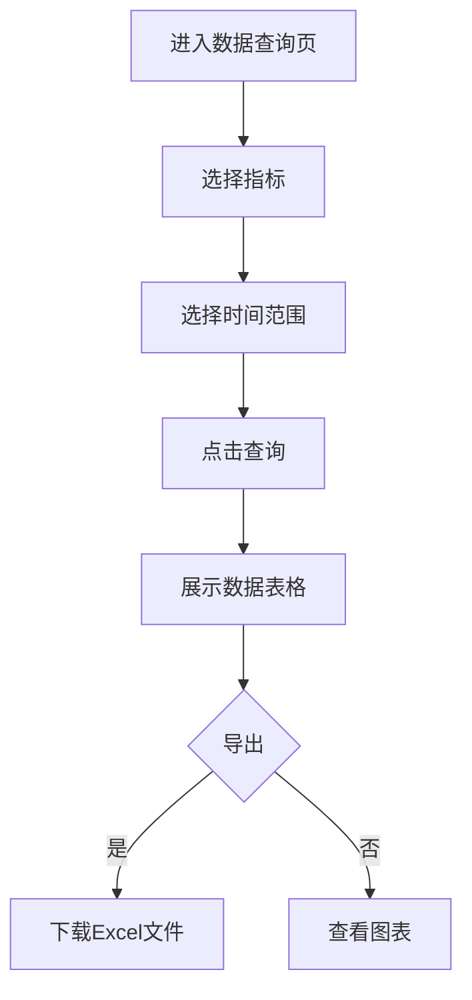

# 掌上供用电后台管理系统 - 产品需求文档 (PRD)

## 1. Product Overview

掌上供用电后台管理系统是为电力行业打造的综合管理平台，用于管理和监控各类电力业务指标数据、工单配置和系统设置。系统采用左侧导航+右侧内容区的经典后台布局，提供指标管理、工单管理、报表分析等核心功能模块。

## 2. Core Features

### 2.1 User Roles
| Role | Registration Method | Core Permissions |
|------|---------------------|------------------|
| 系统管理员 | 后台创建 | 全部权限（增删改查） |
| 业务分析师 | 后台创建 | 指标配置、数据查询、报表导出 |
| 运维人员 | 后台创建 | 数据查询、告警查看 |
| 管理层 | 后台创建 | 只读权限，查看仪表盘和报表 |

### 2.2 Feature Module
1. **仪表盘**: 关键指标卡片、趋势图表、数据概览
2. **指标管理**: 指标列表、新增/编辑指标、指标配置
3. **数据查询**: 历史数据查询、趋势分析、数据导出
4. **告警管理**: 告警规则配置、告警记录查询、通知管理
5. **系统设置**: 用户管理、角色权限、系统配置

### 2.3 Page Details
| Page Name | Module Name | Feature description |
|-----------|-------------|---------------------|
| 仪表盘 | 指标卡片 | 展示关键指标当前值、同比/环比变化 |
| 仪表盘 | 趋势图表 | 展示指标随时间变化趋势 |
| 指标管理 | 指标列表 | 分页展示所有指标，支持搜索筛选 |
| 指标管理 | 指标详情 | 新增/编辑指标配置（基本信息、计算规则、告警配置） |
| 数据查询 | 查询表单 | 指标选择、时间范围选择 |
| 数据查询 | 数据展示 | 数据表格、图表可视化 |
| 告警管理 | 规则配置 | 设置阈值、告警级别、通知用户 |
| 告警管理 | 告警记录 | 查询告警历史、统计分析 |
| 系统设置 | 用户管理 | 用户列表、新增/编辑/删除用户 |
| 系统设置 | 角色权限 | 角色列表、权限配置 |

## 3. Core Process

### 3.1 指标创建流程
用户进入指标列表页 → 点击新增按钮 → 填写基本信息（名称、编码、分类等）→ 配置计算规则（计算方式、公式等）→ 设置告警规则（阈值、级别）→ 保存成功返回列表

### 3.2 数据查询流程
用户进入数据查询页 → 选择指标 → 选择时间范围 → 点击查询 → 查看数据表格 → 可选择导出Excel或查看图表

### 3.3 告警处理流程
指标数据触发阈值 → 系统生成告警 → 通知相关用户 → 用户查看告警 → 处理告警 → 关闭告警

## 4. User Interface Design

### 4.1 Design Style
- **Primary Color**: #1890FF (蓝色) - 用于链接、选中状态、主按钮
- **Success**: #52C41A (绿色) - 成功状态
- **Warning**: #FAAD14 (橙色) - 警告状态
- **Error**: #F5222D (红色) - 错误状态
- **Button Style**: 主按钮蓝色填充圆角2px，白色文字；次按钮灰色边框；文字按钮无边框蓝色文字
- **Font**: -apple-system, BlinkMacSystemFont, Segoe UI, Roboto
- **Layout Style**: 左侧导航(240px) + 右侧内容区，卡片式布局
- **Icon Style**: Lucide图标，16x16px或20x20px

### 4.2 Page Design Overview

| Page Name | Module Name | UI Elements |
|-----------|-------------|-------------|
| 仪表盘 | 指标卡片 | 白色卡片背景、蓝色数值、灰色标签、变化百分比（绿色上升/红色下降） |
| 仪表盘 | 趋势图表 | 折线图/柱状图，支持时间范围切换 |
| 指标管理 | 列表页 | 顶部搜索框+新增按钮、中部数据表格、底部分页组件 |
| 指标管理 | 详情页 | 标签页布局（基本信息、计算规则、告警配置）、表单字段、保存/取消按钮 |
| 数据查询 | 查询页 | 筛选区域（指标选择、时间范围）、数据表格、图表区域、导出按钮 |
| 告警管理 | 规则列表 | 表格展示规则、启用/禁用开关、编辑/删除操作 |
| 告警管理 | 告警记录 | 时间排序、级别标识（红色紧急/橙色高/黄色中/蓝色低） |
| 系统设置 | 用户列表 | 用户头像、姓名、角色、状态、操作列 |

### 4.3 Responsiveness
- Desktop-first design
- 左侧导航在小屏时可折叠为图标模式
- 表格支持横向滚动
- 卡片自适应布局

### 4.4 Design Specifications
- **左侧导航宽度**: 240px，深色背景(#001529)
- **顶部栏高度**: 60px，白色背景
- **内容区背景**: #F5F7FA，内边距24px
- **表格行高**: 48px
- **卡片内边距**: 20px
- **组件间距**: 16px