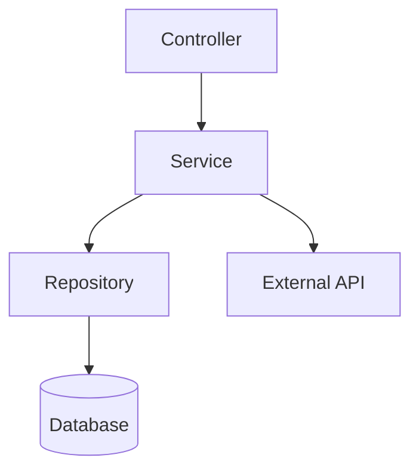
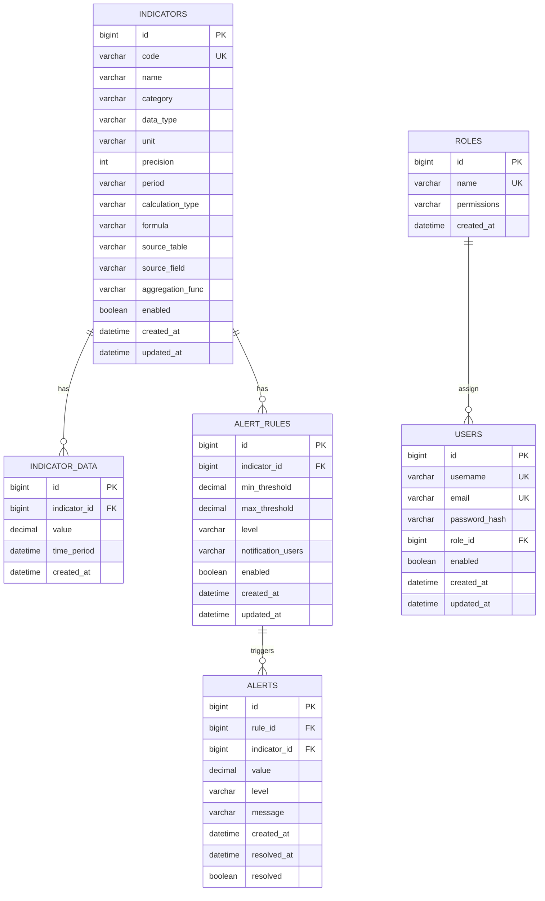

# 掌上供用电后台管理系统 - 技术架构文档

## 1. Architecture Design

```mermaid
layeredGraph LR
    subgraph Frontend
        A[React Components] --> B[State Management]
        B --> C[API Services]
    end
    
    subgraph Backend
        D[Express Server] --> E[Business Logic]
        E --> F[Database]
    end
    
    Frontend -->|HTTP| Backend
```

## 2. Technology Description

* **Frontend**: React\@18 + TypeScript + TailwindCSS\@3 + Vite

* **State Management**: Zustand

* **Routing**: React Router DOM

* **Icons**: Lucide React

* **Charts**: Chart.js / react-chartjs-2

* **Backend**: Express\@4 + TypeScript

* **Database**: SQLite (开发环境) / PostgreSQL (生产环境)

* **Initialization Tool**: vite-init

## 3. Route Definitions

| Route              | Purpose | Component         |
| ------------------ | ------- | ----------------- |
| /                  | 仪表盘首页   | DashboardPage     |
| /indicators        | 指标列表    | IndicatorListPage |
| /indicators/create | 新增指标    | IndicatorFormPage |
| /indicators/:id    | 编辑指标    | IndicatorFormPage |
| /data-query        | 数据查询    | DataQueryPage     |
| /alerts            | 告警记录    | AlertListPage     |
| /alerts/rules      | 告警规则配置  | AlertRulePage     |
| /system/users      | 用户管理    | UserListPage      |
| /system/roles      | 角色权限    | RoleListPage      |

## 4. API Definitions

### 4.1 指标管理API

| API Path                   | Method | Request Body                                                                            | Response                                 |
| -------------------------- | ------ | --------------------------------------------------------------------------------------- | ---------------------------------------- |
| /api/indicators            | GET    | `{ page, size, keyword }`                                                               | `{ data: Indicator[], total: number }`   |
| /api/indicators            | POST   | `{ code, name, category, dataType, unit, precision, period, calculationType, formula }` | `{ success: boolean, data: Indicator }`  |
| /api/indicators/:id        | GET    | -                                                                                       | `{ data: Indicator }`                    |
| /api/indicators/:id        | PUT    | `{ code, name, category, dataType, unit, precision, period, calculationType, formula }` | `{ success: boolean, data: Indicator }`  |
| /api/indicators/:id        | DELETE | -                                                                                       | `{ success: boolean }`                   |
| /api/indicators/:id/toggle | POST   | -                                                                                       | `{ success: boolean, enabled: boolean }` |

### 4.2 指标数据API

| API Path                   | Method | Request Body                          | Response                    |
| -------------------------- | ------ | ------------------------------------- | --------------------------- |
| /api/indicator-data        | GET    | `{ indicatorId, startTime, endTime }` | `{ data: IndicatorData[] }` |
| /api/indicator-data/export | GET    | `{ indicatorId, startTime, endTime }` | Excel文件流                    |

### 4.3 告警API

| API Path              | Method | Request Body                                                            | Response                                |
| --------------------- | ------ | ----------------------------------------------------------------------- | --------------------------------------- |
| /api/alerts           | GET    | `{ page, size, level, startTime, endTime }`                             | `{ data: Alert[], total: number }`      |
| /api/alerts/rules     | GET    | -                                                                       | `{ data: AlertRule[] }`                 |
| /api/alerts/rules     | POST   | `{ indicatorId, minThreshold, maxThreshold, level, notificationUsers }` | `{ success: boolean, data: AlertRule }` |
| /api/alerts/rules/:id | PUT    | `{ indicatorId, minThreshold, maxThreshold, level, notificationUsers }` | `{ success: boolean, data: AlertRule }` |
| /api/alerts/rules/:id | DELETE | -                                                                       | `{ success: boolean }`                  |

### 4.4 用户管理API

| API Path       | Method | Request Body                          | Response                           |
| -------------- | ------ | ------------------------------------- | ---------------------------------- |
| /api/users     | GET    | `{ page, size, keyword }`             | `{ data: User[], total: number }`  |
| /api/users     | POST   | `{ username, email, role, password }` | `{ success: boolean, data: User }` |
| /api/users/:id | PUT    | `{ username, email, role }`           | `{ success: boolean, data: User }` |
| /api/users/:id | DELETE | -                                     | `{ success: boolean }`             |

## 5. Server Architecture Diagram



## 6. Data Model

### 6.1 Data Model Definition



### 6.2 Data Definition Language

```sql
CREATE TABLE indicators (
    id BIGSERIAL PRIMARY KEY,
    code VARCHAR(50) UNIQUE NOT NULL,
    name VARCHAR(100) NOT NULL,
    category VARCHAR(50),
    data_type VARCHAR(20) NOT NULL,
    unit VARCHAR(20),
    precision INT DEFAULT 2,
    period VARCHAR(20) NOT NULL,
    calculation_type VARCHAR(20),
    formula TEXT,
    source_table VARCHAR(100),
    source_field VARCHAR(100),
    aggregation_func VARCHAR(20),
    enabled BOOLEAN DEFAULT true,
    created_at TIMESTAMP DEFAULT CURRENT_TIMESTAMP,
    updated_at TIMESTAMP DEFAULT CURRENT_TIMESTAMP
);

CREATE TABLE indicator_data (
    id BIGSERIAL PRIMARY KEY,
    indicator_id BIGINT REFERENCES indicators(id),
    value DECIMAL(18, 4) NOT NULL,
    time_period TIMESTAMP NOT NULL,
    created_at TIMESTAMP DEFAULT CURRENT_TIMESTAMP
);

CREATE TABLE alert_rules (
    id BIGSERIAL PRIMARY KEY,
    indicator_id BIGINT REFERENCES indicators(id),
    min_threshold DECIMAL(18, 4),
    max_threshold DECIMAL(18, 4),
    level VARCHAR(20) NOT NULL,
    notification_users TEXT,
    enabled BOOLEAN DEFAULT true,
    created_at TIMESTAMP DEFAULT CURRENT_TIMESTAMP,
    updated_at TIMESTAMP DEFAULT CURRENT_TIMESTAMP
);

CREATE TABLE alerts (
    id BIGSERIAL PRIMARY KEY,
    rule_id BIGINT REFERENCES alert_rules(id),
    indicator_id BIGINT REFERENCES indicators(id),
    value DECIMAL(18, 4) NOT NULL,
    level VARCHAR(20) NOT NULL,
    message TEXT,
    created_at TIMESTAMP DEFAULT CURRENT_TIMESTAMP,
    resolved_at TIMESTAMP,
    resolved BOOLEAN DEFAULT false
);

CREATE TABLE roles (
    id BIGSERIAL PRIMARY KEY,
    name VARCHAR(50) UNIQUE NOT NULL,
    permissions TEXT,
    created_at TIMESTAMP DEFAULT CURRENT_TIMESTAMP
);

CREATE TABLE users (
    id BIGSERIAL PRIMARY KEY,
    username VARCHAR(50) UNIQUE NOT NULL,
    email VARCHAR(100) UNIQUE NOT NULL,
    password_hash VARCHAR(255) NOT NULL,
    role_id BIGINT REFERENCES roles(id),
    enabled BOOLEAN DEFAULT true,
    created_at TIMESTAMP DEFAULT CURRENT_TIMESTAMP,
    updated_at TIMESTAMP DEFAULT CURRENT_TIMESTAMP
);

-- Indexes
CREATE INDEX idx_indicator_data_time ON indicator_data(time_period);
CREATE INDEX idx_alerts_created_at ON alerts(created_at);
CREATE INDEX idx_users_role_id ON users(role_id);
```

### 6.3 TypeScript Types

```typescript
export interface Indicator {
    id: number;
    code: string;
    name: string;
    category: string;
    dataType: string;
    unit: string;
    precision: number;
    period: string;
    calculationType: string;
    formula: string;
    sourceTable: string;
    sourceField: string;
    aggregationFunc: string;
    enabled: boolean;
    createdAt: string;
    updatedAt: string;
}

export interface IndicatorData {
    id: number;
    indicatorId: number;
    value: number;
    timePeriod: string;
    createdAt: string;
}

export interface AlertRule {
    id: number;
    indicatorId: number;
    minThreshold: number | null;
    maxThreshold: number | null;
    level: string;
    notificationUsers: string;
    enabled: boolean;
    createdAt: string;
    updatedAt: string;
}

export interface Alert {
    id: number;
    ruleId: number;
    indicatorId: number;
    value: number;
    level: string;
    message: string;
    createdAt: string;
    resolvedAt: string | null;
    resolved: boolean;
}

export interface User {
    id: number;
    username: string;
    email: string;
    roleId: number;
    roleName: string;
    enabled: boolean;
    createdAt: string;
    updatedAt: string;
}

export interface Role {
    id: number;
    name: string;
    permissions: string;
    createdAt: string;
}
```

